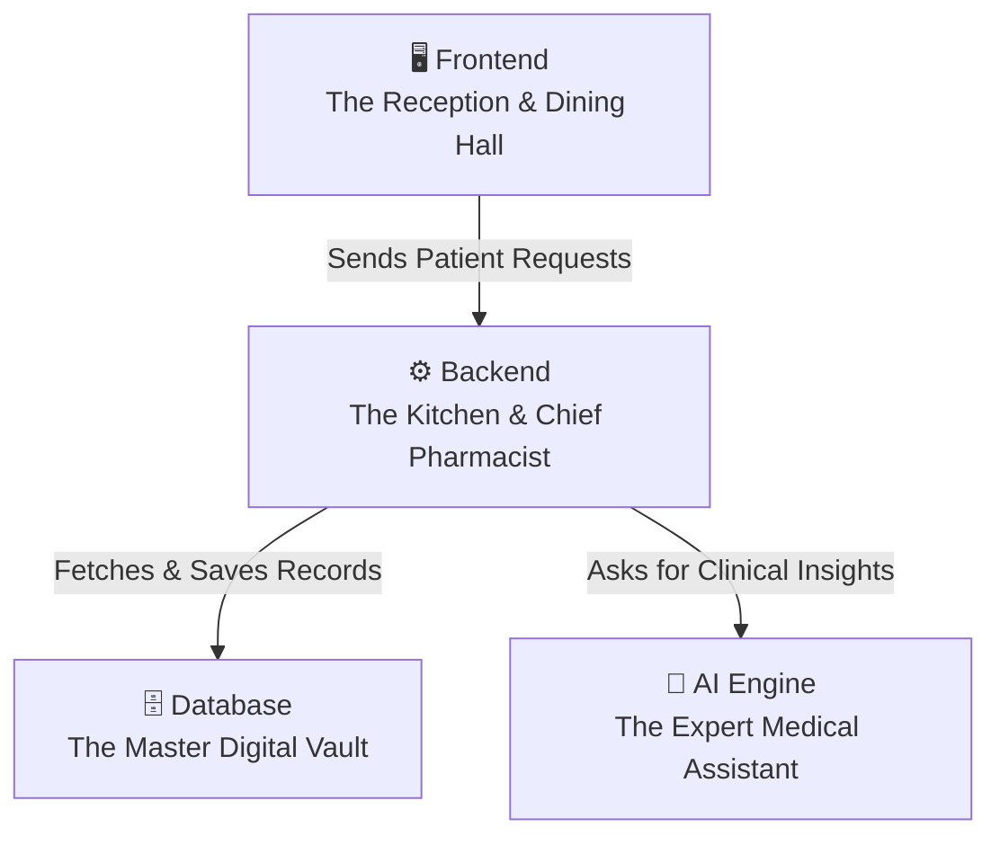
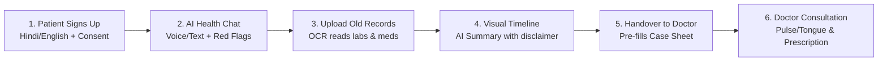

# 🌿 AyushCase — Non-Coder's Complete Guide to Our Technology
**Project:** AyushCase — Smart Automation AYUSH Patient Case-Taking System  
**Hackathon:** Smart India Hackathon 2026 | **Theme:** Ministry of Ayush (Smart Automation)  
**Purpose of this Guide:** Explain every technical piece in **simple everyday words and real-world analogies** so that anyone (judges, doctors, non-technical team members, or evaluators) can easily understand how it works!

---

## 🏥 1. The Big Picture: Think of AyushCase like a Modern Clinic / Restaurant

To understand any web application, imagine a high-tech modern hospital clinic:

1. **Frontend (The Reception & Dining Hall):** Everything the patient and doctor see, touch, click, or speak to on their screens (forms, buttons, colors, charts).
2. **Backend (The Kitchen & Chief Pharmacist):** The invisible brain running on cloud servers that takes patient answers, validates rules, calculates scores, and talks to the database and AI.
3. **Database (The Master Digital Vault):** The super-secure digital filing cabinet where patient profiles, ABHA IDs, prescriptions, and past clinic visits are safely stored forever.
4. **AI Engine (The Expert Medical Assistant):** The smart assistant that asks helpful health questions in Hindi/English, reads messy lab reports, and creates doctor summaries.

---

## 🛠️ 2. Every Technology We Used — Explained Like You're 10

### 1. ⚛️ Next.js 14 & React (The Web Engine)
* **Simple Analogy:** *A super-fast, modular Lego building set for websites that pre-cooks pages before you even click them.*
* **What it does:** It builds all the web pages (Patient Portal, Doctor Dashboard, Case-Taking form) and handles requests in one single framework.
* **Why we used it:** It makes the website load in milliseconds on mobile phones and laptops without any lagging.

---

### 2. 🗄️ Prisma ORM & Database (The Smart Digital Librarian)
* **Simple Analogy:** *An ultra-organized librarian that files every patient record with color-coded labels so no file ever gets lost.*
* **What it does:** It links Doctors, Patients, Case History, and Uploaded Documents through strict relationships.
* **Why we used it:** It protects medical data from corruption and allows us to easily switch from SQLite to massive multi-hospital databases (like PostgreSQL) with zero code rewrites.

---

### 3. 🔐 NextAuth.js & Bcrypt (The Biometric Security Guard)
* **Simple Analogy:** *A biometric security guard at the hospital door who checks doctor badges and turns passwords into unbreakable secret codes.*
* **What it does:** It keeps doctors logged in securely with encrypted tokens and ensures Doctor A cannot peek into Doctor B's private patients.
* **Why we used it:** It protects patient health records (EHR) and keeps medical data legally secure.

---

### 4. 🎙️ Web Speech API (The Built-In Stenographer)
* **Simple Analogy:** *A personal voice typist built right inside your phone that listens in Hindi and English without charging any fee.*
* **What it does:** It listens to the patient talking via microphone and turns spoken words into typed text in real time.
* **Why we used it:** It is 100% free, has zero audio delay, and keeps audio on the patient's phone rather than sending recordings to expensive foreign servers.

---

### 5. 📄 OCR & Entity Extractor (The Intelligent Medical Scanner)
* **Simple Analogy:** *A smart assistant who reads doctor's handwriting and lab reports and highlights dangerous test numbers in bright red.*
* **What it does:** It scans uploaded prescription photos or blood tests, extracts medicine names and dosages, and compares lab numbers against healthy limits (e.g., Blood Sugar > 125 $\rightarrow$ `HIGH`).
* **Why we used it:** Patients don't have to type long medical names, and doctors instantly spot abnormal test values.

---

### 6. 🧠 Hybrid Multi-Model AI (The Doctor Panel with Emergency Books)
* **Simple Analogy:** *A panel of expert AI doctors (Gemini / ChatGPT) backed by an encyclopedia book that works even if the hospital internet cables are cut.*
* **What it does:** It uses Google Gemini 1.5 or OpenAI when online, but automatically falls back to our built-in classical Ayurvedic knowledge engine if offline.
* **Why we used it:** The website never crashes, never shows empty screens, and works 100% reliably during live presentations.

---

### 7. 🚨 Red Flag Emergency Classifier (The Ambulance Alarm)
* **Simple Analogy:** *An automated hospital buzzer that rings immediately if a patient reports life-threatening symptoms.*
* **What it does:** It scans patient messages for heart attack signs, stroke symptoms, or severe breathing trouble, and flashes an emergency triage banner.
* **Why we used it:** Ensures AI never delays emergency care for critical patients, fulfilling top medical safety standards.

---

### 8. 🖨️ jsPDF (The 1-Click Digital Printing Press)
* **Simple Analogy:** *An instant digital printer that turns doctor's case notes into official, stamp-ready PDF prescriptions with one click.*
* **What it does:** It formats patient history, Prakriti constitution scores, pulse findings, and medicines into a clean, printable Ayurvedic prescription.
* **Why we used it:** Patients and doctors can download, print, or share medical records instantly.

---

### 9. ☁️ Vercel & GitHub (The Worldwide Cloud Network)
* **Simple Analogy:** *A global delivery network that keeps the website running 24/7 across the world and updates it automatically whenever we improve code.*
* **What it does:** It hosts the live website in the cloud with automated database self-healing on cold starts.
* **Why we used it:** Anyone with a phone or laptop can access AyushCase anywhere in India with zero installation needed.

---

## 🎬 3. The 6-Step Patient-to-Doctor Story in Simple Words

1. **Step 1 — Sign Up & Consent:** Patient registers with basic info (Name, Age, ABHA ID), chooses Hindi or English, and gives digital consent.
2. **Step 2 — AI Health Interview:** Patient speaks or types their symptoms. The AI asks polite follow-up questions while constantly watching for emergency red flags.
3. **Step 3 — Upload Old Records:** Patient uploads photos of past prescriptions or blood tests. The OCR system extracts medicine names and flags high/low lab test numbers.
4. **Step 4 — Visual Timeline & Summary:** The system arranges past medical history into a clean visual timeline and generates a physician-ready clinical summary.
5. **Step 5 — 1-Click Handover:** Patient clicks *"Send to Doctor"*. When the doctor opens the file, the case sheet is already filled, saving **15 minutes per consultation**!
6. **Step 6 — Doctor Consultation:** The doctor examines the patient (Pulse/Tongue), verifies the pre-filled history, confirms diagnosis, and prints the official Ayurvedic prescription.

---

## 🌟 4. Why This Architecture Wins at SIH 2026

1. **Clinically Safe:** The AI is strictly an intake assistant; the doctor retains 100% prescription authority.
2. **Zero API Running Cost:** On-device voice dictation and offline fallback mean clinics don't pay high monthly AI fees.
3. **Government Standard Compliant:** Integrates 14-digit ABHA IDs (ABDM) and WHO ICD-11 dual diagnostic coding.
4. **Bilingual & Accessible:** Works effortlessly in Hindi and English for rural and urban patients alike.
